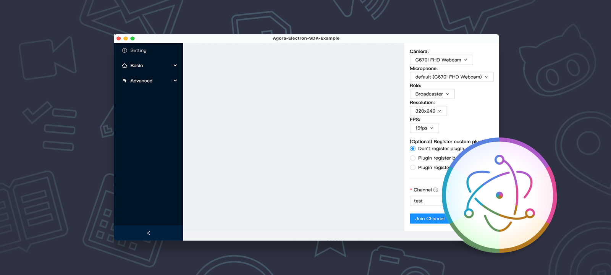

#  Agora Electron API Demos

[![NPM version][npm-image]][npm-url] [![node version][node-image]][node-url] [![npm download][download-image]][download-url] [![npm license][license-image]][download-url]

## Content

- Agora Electron API Demos
  - [Content](#content)
  - [Building](#building)
  - [More](#more)
    - [Integrate SDK with other web frameworks](#integrate-sdk-with-other-web-frameworks)
    - [Use the refactored version of agora-electron-sdk](#use-the-refactored-version-of-agora-electron-sdk)
      - [Building](#building-1)

---

This is a desktop app that interactively and with sample code demonstrates core features of the [Agora-Electron-SDK](https://docs.agora.io/en/Interactive%20Broadcast/API%20Reference/electron/index.html) API. It's built with Electron, too, of course. This app works on Windows, macOS operating systems.

Use this app to see what you can do with Electron and use the source code to learn how to create an audio and video app.



---

Visit the [electron website](https://www.agora.io/en/) for important announcements.

## Building

You'll need [Node.js](https://nodejs.org) and [Yarn](https://yarnpkg.com/) installed on your computer in order to build this app.

```bash
$ git clone https://github.com/AgoraIO-Community/Agora-Electron-Quickstart
$ cd Agora-Electron-API-Examples
$ yarn
$ yarn start
```

## More

### Replace SDK with other version

Our electron project uses Two package.json Structure,if you want use sdk with other version, please replace from [Agora-Electron-API-Example-Iris/src/package.json](https://github.com/AgoraIO-Community/Agora-Electron-Quickstart/blob/master/Agora-Electron-API-Example-Iris/src/package.json) or [Agora-Electron-API-Example/src/package.json](https://github.com/AgoraIO-Community/Agora-Electron-Quickstart/blob/master/Agora-Electron-API-Example/src/package.json)

```json
{
  "dependencies": {
    "agora-electron-sdk": "xxx" // replace here
  }
}

```

- More info about [Two package.json Structure](https://www.electron.build/tutorials/two-package-structure.html)


### Integrate SDK with other web frameworks

- Other
  - [Agora-Electron-HTML5]: An old Demo without web frameworks
  - [Agora-Electron-Premium]: An old Demo uses React
  - [Agora-Electron-React]: A simple case to show how to integrate SDK for React
  - [Agora-Electron-Vue]: A simple case to show how to integrate SDK for Vue

### Use the refactored version of agora-electron-sdk

This [Agora-Electron-API-Example-Iris](https://github.com/AgoraIO-Community/Agora-Electron-Quickstart/tree/master/Agora-Electron-API-Example-Iris) uses a refactored version of [agora-electron-sdk@alpha](https://www.npmjs.com/package/agora-electron-sdk) and demonstrates how to use the new api

#### Building

You'll need [Node.js](https://nodejs.org) and [Yarn](https://yarnpkg.com/) installed on your computer in order to build this app.

```bash
$ git clone https://github.com/AgoraIO-Community/Agora-Electron-Quickstart
$ cd Agora-Electron-API-Example-Iris
$ yarn
$ yarn start
```

[npm-image]: https://img.shields.io/npm/v/agora-electron-sdk.svg?style=flat-square
[npm-url]: https://npmjs.org/package/agora-electron-sdk
[node-image]: https://img.shields.io/badge/node.js-%3E=_4.0-green.svg?style=flat-square
[node-url]: http://nodejs.org/download/
[download-image]: https://img.shields.io/npm/dm/agora-electron-sdk.svg?style=flat-square
[download-url]: https://npmjs.org/package/agora-electron-sdk
[license-image]: https://img.shields.io/npm/l/agora-electron-sdk.svg
[agora-electron-html5]: https://github.com/AgoraIO-Community/Agora-Electron-Quickstart/tree/master/Other/Agora-Electron-HTML5
[agora-electron-premium]: https://github.com/AgoraIO-Community/Agora-Electron-Quickstart/tree/master/Other/Agora-Electron-Premium
[agora-electron-react]: https://github.com/AgoraIO-Community/Agora-Electron-Quickstart/tree/master/Other/Agora-Electron-React
[agora-electron-vue]: https://github.com/AgoraIO-Community/Agora-Electron-Quickstart/tree/master/Other/Agora-Electron-Vue
